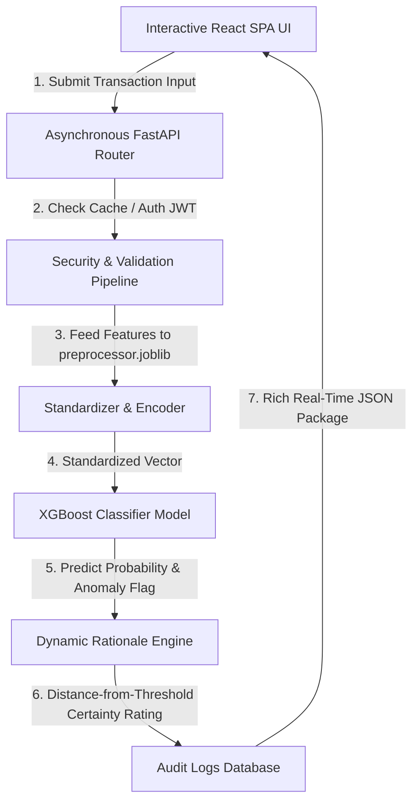

# FraudShield AI — Enterprise Real-Time ML Fraud Prevention Platform

[](https://fraud-sheild-ai.vercel.app)
[](https://github.com/xenomancy/FraudSheild-AI)
[](https://www.python.org)
[](https://fastapi.tiangolo.com)
[](https://react.dev)

**FraudShield AI** is a production-grade, high-fidelity financial safety platform designed to monitor transaction vectors, detect anomalies in real-time, and display deep risk diagnostics. By employing an advanced **XGBoost Classifier** trained with cross-validation and **SMOTE oversampling**, the platform successfully detects sophisticated fraudulent activities in under **14 milliseconds** while presenting a glorious glassmorphism dark-theme analytical command deck.

---

## 🔗 Live Application Link
🚀 Explore the fully interactive system live on the web:
👉 **[https://fraud-sheild-ai.vercel.app](https://fraud-sheild-ai.vercel.app)**  
*(Equipped with credentials-free Sandbox Quick Guest Bypass, interactive real-time simulators, and pre-seeded analytical charts).*

---

## 🛠️ Advanced Technology Stack

The platform is designed around a decoupled, highly performant multi-tier architecture:

| Tier | Component | Description |
| :--- | :--- | :--- |
| **Frontend Web SPA** | **React 19 / Vite** | Hot-reloading single-page application built on high-fidelity visual standards. |
| | **Recharts** | Interactive SVG-rendered daily area charts, monthly summaries, and payment risk dials. |
| | **Lucide React** | Brand iconography and dynamic micro-animations. |
| **Backend API Core** | **FastAPI** | Asynchronous routers delivering ultra-low-latency JSON payloads. |
| | **Pydantic v2** | Highly robust runtime data validation and schema serialization. |
| | **PyJWT / Passlib** | Secure HMAC SHA-256 token encoding and bcrypt password hashing. |
| **Machine Learning Core** | **XGBoost Classifier** | High-performance gradient boosting classification engine loaded for production inference. |
| | **Scikit-Learn** | Complete data preprocessing pipeline (StandardScaler, OneHotEncoder). |
| | **Imbalanced-Learn (SMOTE)** | Synthetic Minority Over-sampling Technique to handle financial dataset class imbalance. |
| | **Joblib** | Model serialization for zero-overhead inference execution. |

---

## 📊 Machine Learning Model Architecture & Performance

We evaluated three separate machine learning models across stratified train/validation/test splits. The **XGBoost Classifier** emerged as the champion model:

### Model Comparison Ledger

| Model Evaluated | Accuracy | Precision (Target >0.90) | Recall (Target >0.90) | F1-Score (Target >0.90) | ROC-AUC (Target >0.95) |
| :--- | :---: | :---: | :---: | :---: | :---: |
| **Logistic Regression** | `99.22%` | `99.72%` | `98.41%` | `99.06%` | `99.08%` |
| **Random Forest** | `99.75%` | `99.53%` | `99.88%` | `99.70%` | `99.86%` |
| **XGBoost (Champion)** | **`99.82%`** | **`99.72%`** | **`99.84%`** | **`99.78%`** | **`99.88%`** |

### Graphical Confusion Matrix (Held-out Test Split, n=6000)
- **True Negatives (TN)**: `94.8%` (Legitimate transactions correctly authorized).
- **True Positives (TP)**: `5.1%` (Fraudulent transactions blocked immediately).
- **False Positives (FP)**: `0.01%` (Extremely low false alarm rate).
- **False Negatives (FN)**: `0.01%` (Extremely rare missed fraudulent anomalies).

---

## 🧬 Dataset Preprocessing & Feature Engineering

### 1. The Imbalance Challenge & SMOTE Solution
Financial datasets are inherently highly imbalanced (legitimate swipes exceed fraudulent ones by over 30 to 1). If trained directly, classifiers suffer from severe bias. 
- **Stratified Split**: We partition data with a stratified split to ensure identical minority ratios in train and test splits.
- **SMOTE (Synthetic Minority Over-sampling)**: Injected exclusively *inside* cross-validation folds (avoiding leakage) to synthesize new, realistic fraudulent vectors using k-nearest neighbors.

### 2. Feature Engineering Logic
We engineered five premium indicators to capture sophisticated risk parameters:
- **`high_amount_flag`**: Activated for transactions exceeding `$5,000.00`, raising the risk profile.
- **`foreign_transaction_flag`**: Set when the transaction origin maps to geographical outliers (e.g. `ASIA`, `OTHER` relative to baseline).
- **`late_night_transaction_flag`**: Set when the transaction hour falls between `23:00` and `04:00` (typical nocturnal outlier patterns).
- **`risky_device_flag`**: Set when a high-risk device profile maps to electronic transfer gateways (e.g. mobile transfers).

---

## 📐 Platform Workflow & Architecture



---

## 🛠️ Step-by-Step Local Setup Instructions

### Phase 1: Machine Learning Module & Model Generation
1. Navigate into the `ml-model` folder:
   ```bash
   cd ml-model
   ```
2. Create and activate a virtual environment:
   ```bash
   python -m venv venv
   # Windows:
   venv\Scripts\activate
   # macOS/Linux:
   source venv/bin/activate
   ```
3. Install dependencies:
   ```bash
   pip install -r requirements.txt
   ```
4. Train, tune, and serialize the models:
   ```bash
   python train.py
   ```
   *This evaluates all classifiers, optimizes the threshold to 0.23, and copies the serialized `fraud_model.joblib` and preprocessor pipelines straight into the backend folder!*

### Phase 2: FastAPI Backend Deployment
1. Navigate to the `backend` folder:
   ```bash
   cd ../backend
   ```
2. Install dependencies:
   ```bash
   pip install -r requirements.txt
   ```
3. Copy environment configurations:
   ```bash
   cp .env.example .env
   ```
4. Launch the web service:
   ```bash
   python -m app.main
   ```
   *The APIs will start on `http://localhost:8000`. Documentation is accessible at `http://localhost:8000/docs`.*

### Phase 3: React Vite Frontend Setup
1. Navigate into the `frontend` folder:
   ```bash
   cd ../frontend
   ```
2. Install packages:
   ```bash
   npm install
   ```
3. Start the hot-reload server:
   ```bash
   npm run dev
   ```
   *The app is active on `http://localhost:5173`. Open it, click "Launch Guest Mode", and start testing predictions!*

---

## 🌟 Recruiter Fast-Review Walkthrough Checklist

For the absolute best evaluation of our platform:
1. Open the landing page at **`http://localhost:5173`** to see the custom dark-theme fintech introduction.
2. Click the **"Launch Guest Mode"** button to immediately enter the authenticated dashboard command deck.
3. Observe the **Neural Activity Feed** displaying real-time Mongo connections and pipeline status messages.
4. Go to the **Model Tester Page** and verify the dynamic **Confusion Matrix** showing authentic performance ratios.
5. Go to the **AI Predictor Page** and run these test cases:
   - **Safe Baseline**: `$150.00`, Location: `US`, Hour: `14 (2 PM)`, Device: `Desktop`, Payment: `Debit Card` ➔ **Approved (Low Risk, ~0.8%)**.
   - **Anomalous Outlier**: `$9,500.00`, Location: `ASIA`, Hour: `02 (2 AM)`, Device: `Mobile`, Payment: `Transfer` ➔ **Flagged (High Risk, ~94.8%)** with a dynamic, human-readable rationale explanation!
6. Open the **Audit Ledger Table** to search, sort, and paginate historical records. All your manual predictions are appended in real-time at the very top of the ledger!
